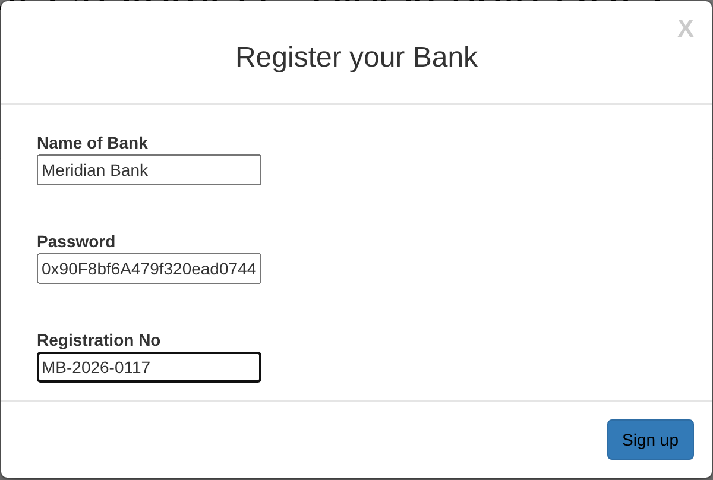
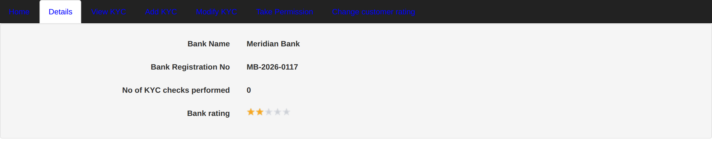
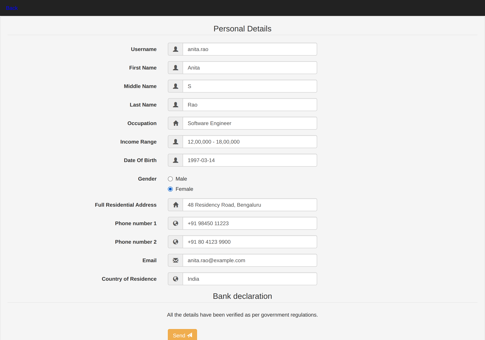
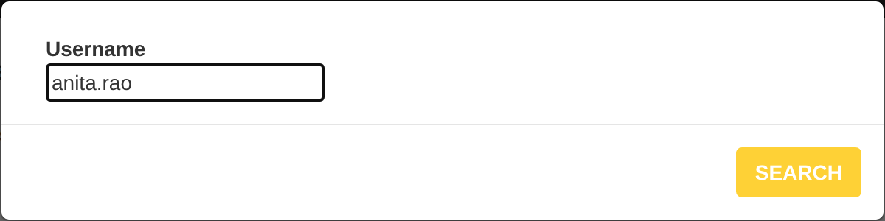
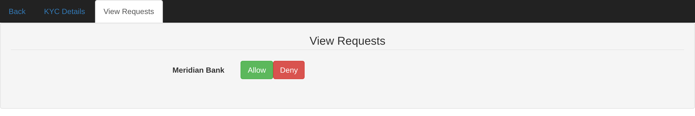
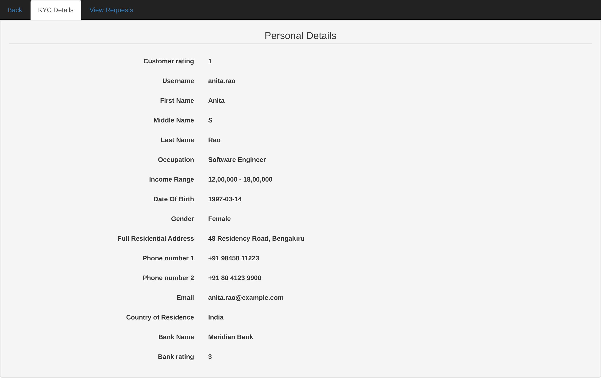
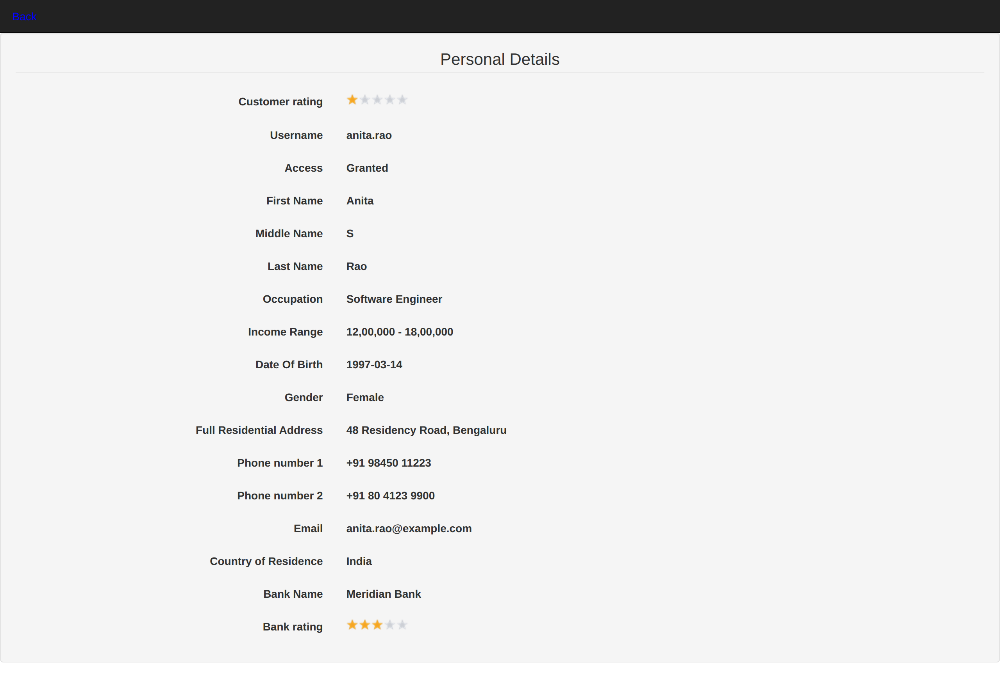
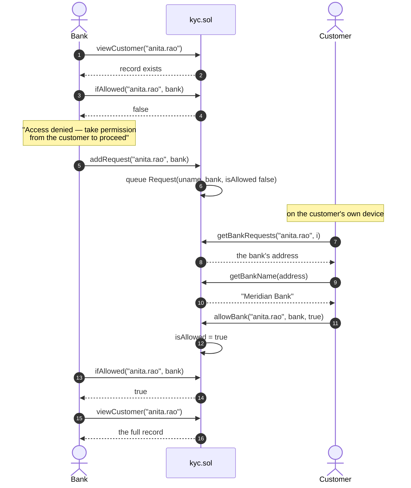
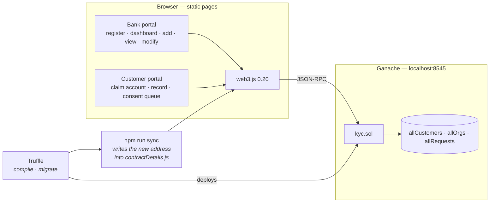

<div align="center">

# Decentralised KYC Verification

### A Know Your Customer platform on Ethereum, where the customer — not the bank — controls who may read their file

Banks register on chain, verify a customer once, and every other institution can rely on that
verification **only if the customer grants them access**. Consent is a row on the ledger, not a
promise in a privacy policy.

[](https://soliditylang.org)
[](https://archive.trufflesuite.com)
[](https://archive.trufflesuite.com/ganache/)
[](https://web3js.org)
[](LICENSE)
[](https://github.com/VivekReddy2001/Dapp-for-decentralized-KYC-verification/actions/workflows/build.yml)

[How it works](#how-it-works) · [Walkthrough](#walkthrough) · [Architecture](docs/ARCHITECTURE.md) · [Contract reference](docs/CONTRACT.md) · [Security](SECURITY.md)

</div>

---

## Table of contents

- [Why this exists](#why-this-exists)
- [Screenshots](#screenshots)
- [What it does](#what-it-does)
- [How it works](#how-it-works)
- [Tech stack](#tech-stack)
- [Architecture](#architecture)
- [Project structure](#project-structure)
- [Getting started](#getting-started)
- [Walkthrough](#walkthrough)
- [The smart contract](#the-smart-contract)
- [Tests](#tests)
- [Security — read this one](#security--read-this-one)
- [What changed when this was published](#what-changed-when-this-was-published)
- [Roadmap](#roadmap)
- [Credits](#credits)
- [Licence](#licence)

---

## Why this exists

KYC is the identity check a bank runs before it takes you on. Today every institution runs its own:
you hand over the same passport, the same proof of address and the same income statement to each one
in turn, each keeps a private copy, and none of them can tell that four others already verified you.
It is expensive for them and tedious for you, and the copies are exactly the thing that leaks.

This project started somewhere else. The original goal was a **peer-to-peer lending platform** —
borrowers post a request with the amount, the interest they are willing to pay and supporting
documents; lenders browse the pool and make offers; the agreement is recorded on chain and a credit
score is built from it. That design broke on a problem that has nothing to do with lending:

> a blockchain has no idea whether ten borrower accounts are ten people or one person ten times

Without identity, every credit model on an open network is one anonymous actor away from worthless.
So the identity layer had to be built first — and it turned out to be the more interesting half.
**This repository is that layer.**

The design is deliberately **semi-decentralised**. Who has been verified, by whom, and who may read a
file all live on chain, because those facts need to be shared and auditable. The documents themselves
are meant to live off chain — see [Security](#security--read-this-one), where the fact that this build
does *not* yet do that is the first finding.

---

## Screenshots

| Bank registers on the network | Bank dashboard |
| :-- | :-- |
|  |  |

| Creating a KYC record | Requesting the customer's consent |
| :-- | :-- |
|  |  |

| The customer's consent queue | The customer's own record |
| :-- | :-- |
|  |  |

| The bank reads the record, after consent |
| :-- |
|  |

Every screenshot is from the running application against a local Ganache chain — the same flow the
[walkthrough](#walkthrough) below reproduces.

---

## What it does

### For a bank

- **Register on the network.** The first institution bootstraps it; after that, an existing member has
  to send the transaction that adds the next one — so membership grows by referral, not by self-service.
- **Create a KYC record** from a thirteen-field form. The record is written to the ledger and the
  bank's reputation goes up.
- **Read a record — with permission.** A bank that has not been granted access sees a refusal and can
  queue a request; nothing happens until the customer answers it.
- **Update or delete a record**, and **rate a customer** up or down.
- **A reputation of its own**, derived from how many verifications it has performed and whether any of
  them were later withdrawn.

### For a customer

- **Claim the record** a bank created, once, with a username and password.
- **See exactly what is held about you** — every field, the bank that verified you, and that bank's
  rating.
- **Answer access requests.** A queue of institutions asking to read your file, each with Allow and
  Deny. Nothing is shared until you press Allow.

### On chain

- Three entities — `Customer`, `Organisation`, `Request` — and twenty-four public functions.
- Consent modelled as a first-class object, not a flag inside a bank's own database.
- A reputation system with diminishing returns, so a bank cannot inflate its score by bulk-adding
  records.

---

## How it works

The consent handshake is the heart of it:



Four properties fall out of doing it this way:

1. **The customer is the gatekeeper.** No institution can grant itself access to a file.
2. **Every grant is auditable.** The request row and its consent flag are on the ledger, so a customer
   can prove afterwards who was allowed to look.
3. **Verification happens once.** The second bank does not re-verify; it asks the customer to unlock
   what the first bank already established.
4. **Reputation is shared.** A customer choosing between institutions can see how many verifications
   each has performed and how they are rated.

That is the design. The honest caveat — that in **this build** the consent check happens in the web
page rather than inside `viewCustomer`, so it is enforced by the UI rather than the contract — is
finding 3 in [`SECURITY.md`](SECURITY.md), along with the four-line fix.

---

## Tech stack

| Layer | Choice | Why |
| --- | --- | --- |
| Smart contract | **Solidity 0.5** | The contract grows storage arrays with `array.length++`, which Solidity removed in 0.6, so the 0.5 line is the only one it compiles on. `truffle-config.js` pins 0.5.0 — the version recorded in the original build artefact, so it is known to work. |
| Toolchain | **Truffle 5** | Compile, migrate and artefact management. Sunset in 2023 — replacing it with Hardhat is on the roadmap. |
| Local chain | **Ganache 7** | Ten funded, deterministic accounts and instant blocks. `--wallet.deterministic` keeps them identical on every machine, which is what makes the walkthrough below reproducible. |
| Client library | **web3.js 0.20** | Synchronous calls, which is why the page scripts are so short. Also deprecated — it blocks the UI thread. |
| Front end | **Static HTML, Bootstrap 3, jQuery** | No build step at all. Open a page, read the source, understand it. |
| Serving | **`node scripts/serve.js`** | Twenty lines, zero dependencies. Browsers give `file://` pages a null origin, which blocks the calls web3 makes — so the pages need an HTTP origin and nothing more. |

---

## Architecture



**[`docs/ARCHITECTURE.md`](docs/ARCHITECTURE.md)** is the full engineering write-up: high-level design
(system context, containers, the on-chain data model, the trust model, and the design decisions with
their alternatives) and low-level design (sequence diagrams for every flow, the request state machine,
how a record is encoded, the rating maths, storage costs and the return-code table) — twelve diagrams
in total.

---

## Project structure

```
Dapp-for-decentralized-KYC-verification/
├── contracts/
│   ├── kyc.sol                    # The entire application logic — 24 public functions
│   └── Migrations.sol             # Truffle's deployment bookkeeping
├── migrations/                    # Deployment scripts
├── scripts/
│   ├── sync-contract.js           # Copies the deployed address + ABI into the front end
│   └── serve.js                   # Dependency-free static server for src/
├── src/
│   ├── index.html                 # Bank portal — register and sign in
│   ├── indexCustomer.html         # Customer portal — claim an account and sign in
│   ├── customerHomePage.html      # Customer: own record + consent queue
│   ├── resources/
│   │   ├── bankHomePage.html      # Bank dashboard
│   │   └── form/                  # addForm · viewForm · modifyForm
│   ├── js/contractDetails.js      # Generated: ABI, bytecode, address, form field ids
│   ├── dist/                      # web3.js 0.20
│   ├── RSA_JS/                    # RSA implementation — wired into the pages, not yet called
│   ├── css/ · img/ · vendor/      # Bootstrap 3, jQuery, Font Awesome, the Agency theme
├── docs/
│   ├── ARCHITECTURE.md            # HLD + LLD, 12 diagrams
│   ├── CONTRACT.md                # Every public function, its access rules and its gotchas
│   └── screenshots/
├── SECURITY.md                    # Findings, with the fix for each one
├── CONTRIBUTING.md
└── truffle-config.js              # Network + the pinned compiler version
```

---

## Getting started

**You need** Node.js 20 or newer, and nothing else — Ganache and Truffle install with the project.

```bash
git clone https://github.com/VivekReddy2001/Dapp-for-decentralized-KYC-verification.git
cd Dapp-for-decentralized-KYC-verification
npm install
```

Then, in **two terminals**:

```bash
# terminal 1 — the local Ethereum network, ten funded accounts, deterministic
npm run chain
```

```bash
# terminal 2 — compile, deploy, and write the new address into the front end
npm run deploy

# ...then serve the pages
npm run serve
```

Open **<http://localhost:8080/index.html>** for the bank portal and
**<http://localhost:8080/indexCustomer.html>** for the customer portal.

### The commands

| Command | What it does |
| --- | --- |
| `npm run chain` | Ganache on `127.0.0.1:8545`, network id 5777, ten deterministic accounts |
| `npm run compile` | `truffle compile` with the pinned solc 0.5.0 |
| `npm run migrate` | Deploys the contract to the running chain |
| `npm run sync` | Copies the deployed address and ABI into `src/js/contractDetails.js` |
| `npm run deploy` | `migrate` then `sync` — the one you normally want |
| `npm run serve` | Static server for `src/` on port 8080 |
| `npm test` | Contract test suite against the running chain (see below) |

> **If every page loads but all the data is blank**, the front end is pointing at an old contract
> address — restart Ganache, then run `npm run deploy` again. Each `truffle migrate` deploys a fresh
> contract, and `npm run sync` is what tells the browser where it went.

---

## Walkthrough

Ganache starts with the same ten accounts every time, so these steps produce exactly the screenshots
above. Account 0 is `0x90F8bf6A479f320ead074411a4B0e7944Ea8c9C1`.

**1. Register a bank.** On the bank portal, choose *Sign Up* and enter:

| Field | Value |
| --- | --- |
| Bank name | `Meridian Bank` |
| Password | `0x90F8bf6A479f320ead074411a4B0e7944Ea8c9C1` |
| Registration number | `MB-2026-0117` |

> The field labelled "password" wants an **Ethereum address** — the contract parameter is
> `address password`. Use Ganache's account 0, because the pages send their transactions from it.
> That this is called a password at all is finding 7 in [`SECURITY.md`](SECURITY.md).

**2. Sign in** with the same name and address. You land on the dashboard, showing the registration
number, the number of verifications performed, and a two-star starting rating.

**3. Add a customer.** *Add KYC* → fill in the form → submit. Use `anita.rao` as the username. The
bank's rating rises to three stars and its verification count to one.

**4. Try to read the record.** *View KYC* → `anita.rao` → **Access denied**. Accept the prompt and the
bank's request is queued on chain.

**5. Become the customer.** Open the customer portal, *Register* with username `anita.rao` and any
password, then sign in. You will see the full record the bank wrote, and the bank's rating.

**6. Answer the request.** *View Requests* shows **Meridian Bank** with **Allow** and **Deny**. Press
Allow.

**7. Read it as the bank.** Back on the bank portal, *View KYC* → `anita.rao` now opens the record.

That is the whole point of the project in seven steps: the bank could not read the file until the
person it describes said yes.

---

## The smart contract

`contracts/kyc.sol` — one contract, three structs, twenty-four public functions, no inheritance and
no external libraries.

| Group | Functions |
| --- | --- |
| Bank registration | `addBank` · `removeBank` · `isPartOfOrg` · `checkBank` |
| Customer records | `addCustomer` · `modifyCustomer` · `removeCustomer` · `viewCustomer` |
| Consent | `addRequest` · `allowBank` · `ifAllowed` · `getBankRequests` |
| Customer accounts | `setPassword` · `checkCustomer` |
| Reputation | `updateRating` · `updateRatingCustomer` |
| Getters | `getBankName` · `getBankEth` · `getBankReg` · `getBankKYC` · `getBankRating` · `getCustomerRating` · `getCustomerBankName` · `getCustomerBankRating` |

The contract signals outcomes with return codes rather than reverting — `0` success, `1` not found,
`2` username taken, `7` not a registered bank — which is why the front end calls each function once
to read the code before sending the transaction that does the work.

**[`docs/CONTRACT.md`](docs/CONTRACT.md)** documents every one: parameters, access rules, gas
characteristics and the specific gotcha where there is one.

---

## Tests

```bash
npm run chain   # terminal 1
npm test        # terminal 2
```

`test/kyc.test.js` deploys a fresh contract for every test and runs 19 checks against the chain:

| Group | What it checks |
| --- | --- |
| Intended behaviour (5) | Network bootstrap and bank membership, customer add / view / update and refusal for outsiders, bank rating rewards, access requests and grants, bank and customer sign-in |
| `SECURITY.md` findings, reproduced (14) | #1 and #2 read KYC data and a password **straight out of contract storage** with `eth_getStorageAt`, bypassing `"Access denied!"`; #3 an ungranted bank reads a record; #4 a stranger grants access; #5 one bank overwrites another's customer; #6 anyone moves a rating; #7 the bank "password" is its public address; #8 the three broken removal loops (a revert, a removal that deletes the *wrong* customers, an out-of-gas refusal); #9 a bank rating that wraps to 2²⁵⁶ − 100 and a customer downvote that divides by zero; #11 consent cannot be withdrawn; #13 no events are emitted |

The second group asserts the current, flawed behaviour on purpose. Fixing a finding makes its test
fail, which is the signal to rewrite that test to assert the fix.

---

## Security — read this one

This is a **student project**, published so the design and its flaws can be read. It runs against a
local chain on purpose and must not be used with anyone's real identity documents.

[`SECURITY.md`](SECURITY.md) is a findings report: fourteen issues, each with its severity, why it
matters and the fix it needs. Every contract-level finding is also **reproduced by a test** in
[`test/kyc.test.js`](test/kyc.test.js), run in CI on every push, so each claim in the report can be
checked rather than taken on trust. The three that matter most:

| # | Finding | Severity |
| --- | --- | --- |
| 1 | Every KYC field is stored in the clear on the ledger, where anyone with the contract address can read it | **Critical** |
| 2 | Customer passwords are stored in the clear in contract storage | **Critical** |
| 3 | The consent check runs in the web page, not in `viewCustomer` — so a bank calling the contract directly bypasses it | **Critical** |

Finding 3 is a four-line change and is the first item on the roadmap. Writing them down rather than
quietly patching them away is deliberate: the gap between *an architecture that models consent
correctly* and *an implementation that enforces it in the wrong layer* is the most useful thing in
this repository.

---

## What changed when this was published

The project was written in 2022 and had never been pushed. Getting it to run again needed a small
number of changes, none of which touch the application logic:

| Change | Why |
| --- | --- |
| **Pinned the Solidity compiler to 0.5.0** | `truffle compile` picks a modern solc by default, and the contract cannot compile on 0.6 or later — `array.length++` was removed. Without the pin the build fails before it starts. |
| **Merged two conflicting Truffle configs** | `truffle.js` and `truffle-config.js` both existed, and only one carried the network settings. Now there is one file. |
| **Added `npm run sync`** | Every `truffle migrate` deploys to a new address that had to be pasted into the front end by hand. Forgetting meant the pages loaded but all the data was blank. |
| **Added `npm run serve`** | The pages need an HTTP origin; opening them from the file system silently blocks every contract call. |
| **Removed 43 MB of committed `node_modules`** | Dependencies were checked in under `src/`. |
| **Restored the bank's View KYC page** | Twelve of its fifteen field rows were commented out in `viewForm.html` while the script still wrote to them — so rendering stopped at the first missing element and the page showed only a username. Uncommenting them brought the page back. |
| **Replaced an external star sprite** | The rating widget loaded an image from a third-party site over plain HTTP on every page load. It is now a local asset. |
| **Deleted dead files** | `src/init.js` referenced a contract path that does not exist and was not loaded by any page. |

The contract itself is **unchanged**, byte for byte. The findings in `SECURITY.md` are documented
rather than patched, so what is published is the project as it was built, with an honest reading of it.

---

## Roadmap

1. **Move the consent check into the contract** — `require(ifAllowed(uname, msg.sender))` inside
   `viewCustomer`. Four lines, and the security model becomes real rather than cosmetic.
2. **Take personal data off the chain.** Encrypt in the browser with the RSA implementation already
   sitting unused in `src/RSA_JS/`, pin the ciphertext to IPFS, keep only the content identifier on
   chain. This was always the plan.
3. **Replace passwords with wallet signatures** through MetaMask, so no secret is stored anywhere.
4. **Add `revokeBank`** — consent that cannot be withdrawn is not really consent.
5. **Emit events** for registration, record changes and consent, so there is an auditable history
   rather than only current state.
6. **Modernise the toolchain** — Hardhat, ethers v6, Solidity 0.8 with checked arithmetic. The test
   suite already pins down the current behaviour, so the port can be checked finding by finding:
   each "reproduced" test should start failing as its finding is fixed.
7. **Then the lending platform this was built for:** a borrower pool carrying amount, interest and
   supporting documents, lenders making offers, agreements recorded on chain, and a credit score built
   from repayment history — with this KYC layer keeping one person to one identity.

---

## Credits

- **[Start Bootstrap — Agency](https://startbootstrap.com/theme/agency)** (MIT) — the front-end theme.
- **[Bootstrap 3](https://getbootstrap.com)**, **[jQuery](https://jquery.com)**,
  **[Font Awesome](https://fontawesome.com)** — vendored under `src/vendor/`.
- **[jsbn](http://www-cs-students.stanford.edu/~tjw/jsbn/)** by Tom Wu — the RSA and big-integer
  implementation in `src/RSA_JS/`.
- **[Truffle](https://archive.trufflesuite.com)** and **[Ganache](https://archive.trufflesuite.com/ganache/)**
  — the development toolchain.

The smart contract, both portals, the page scripts and the documentation in this repository are the
project's own work.

---

## Licence

[MIT](LICENSE) — see the file for details.

## Author

**Vivek Reddy** · [github.com/VivekReddy2001](https://github.com/VivekReddy2001)
