# Architecture

High-level design (HLD) and low-level design (LLD) for the decentralised KYC platform.

The [README](../README.md) explains what the project does and how to run it. This document
explains **how it is built and why**, and is honest about the parts that would be built
differently today — those are collected in [`SECURITY.md`](../SECURITY.md) and section
[3.2](#32-what-a-rewrite-would-change). Every diagram is Mermaid, so it renders on GitHub.

---

## Table of contents

**Part 1 — High-level design**

1. [The problem this solves](#11-the-problem-this-solves)
2. [System context](#12-system-context)
3. [Container view](#13-container-view)
4. [On-chain data model](#14-on-chain-data-model)
5. [Runtime and deployment](#15-runtime-and-deployment)
6. [Design decisions](#16-design-decisions)
7. [Trust model](#17-trust-model)

**Part 2 — Low-level design**

8. [Page map and navigation](#21-page-map-and-navigation)
9. [Sequence — a bank joins the network](#22-sequence--a-bank-joins-the-network)
10. [Sequence — creating a KYC record](#23-sequence--creating-a-kyc-record)
11. [Sequence — consent, the core of the design](#24-sequence--consent-the-core-of-the-design)
12. [State machine — an access request](#25-state-machine--an-access-request)
13. [How a record is encoded](#26-how-a-record-is-encoded)
14. [The rating algorithm](#27-the-rating-algorithm)
15. [Storage layout and cost](#28-storage-layout-and-cost)
16. [Return codes](#29-return-codes)

**Part 3 — Cross-cutting**

17. [The local environment](#31-the-local-environment)
18. [What a rewrite would change](#32-what-a-rewrite-would-change)
19. [Roadmap](#33-roadmap)

---

# Part 1 — High-level design

## 1.1 The problem this solves

KYC — Know Your Customer — is the identity check a regulated business runs before it takes you on
as a customer. Today every institution runs it separately: you hand the same passport, the same
proof of address and the same income statement to each bank in turn, each one stores its own copy,
and none of them can tell that the other four already verified you.

That is expensive for the institutions and miserable for the customer, and it creates a second
problem in any open marketplace: **one person can present as many people**. This project began as
the identity layer for a peer-to-peer lending platform, where a single anonymous actor creating
twenty borrower accounts would have broken the credit model entirely. Verifying identity once, on a
shared ledger that every participant can read, is what closes that hole.

The design here is **semi-decentralised on purpose**:

| Concern | Where it lives | Why |
|---|---|---|
| Who has been verified, by whom, and when | On-chain | It must be shared, tamper-evident and independently auditable |
| Which bank may read which customer's file | On-chain | Consent is the whole point — it has to be enforced, not promised |
| Reputation of banks and customers | On-chain | Derived from verifiable events, and readable by every participant |
| The KYC document contents | Off-chain in the roadmap, on-chain in this build | Personal data on a public ledger is permanent and world-readable — see [SECURITY.md](../SECURITY.md) |

## 1.2 System context

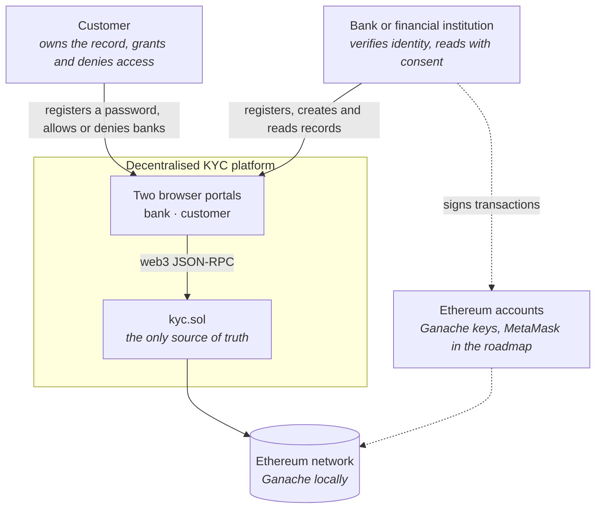

**What is trusted.** The chain is the authority: no server, no database, and no administrator sits
between the two portals. Both portals are static files; deleting them changes nothing about the
data. Anyone can write their own client against the same contract address.

**What is not.** Anything the browser holds — the pages, `localStorage`, the account it uses — is
under the user's control and cannot be trusted by the contract. Section [1.7](#17-trust-model)
covers where this build takes that seriously and where it does not.

## 1.3 Container view

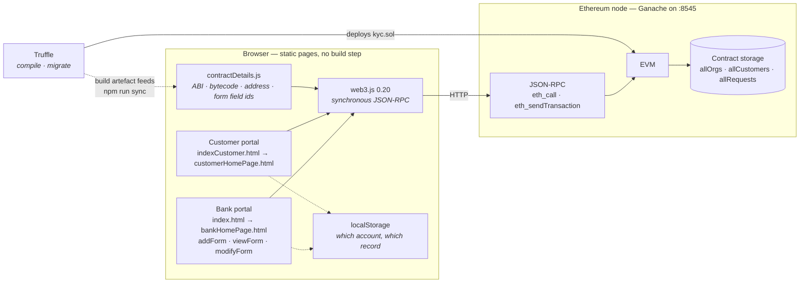

There is no server tier at all. `scripts/serve.js` exists only because browsers refuse to make
XHR calls from a `file://` origin — it serves static files and nothing else. Every read and every
write in the diagram above ends at the contract.

## 1.4 On-chain data model

Three dynamic arrays in contract storage. No mappings — which matters, and section
[2.8](#28-storage-layout-and-cost) explains why.

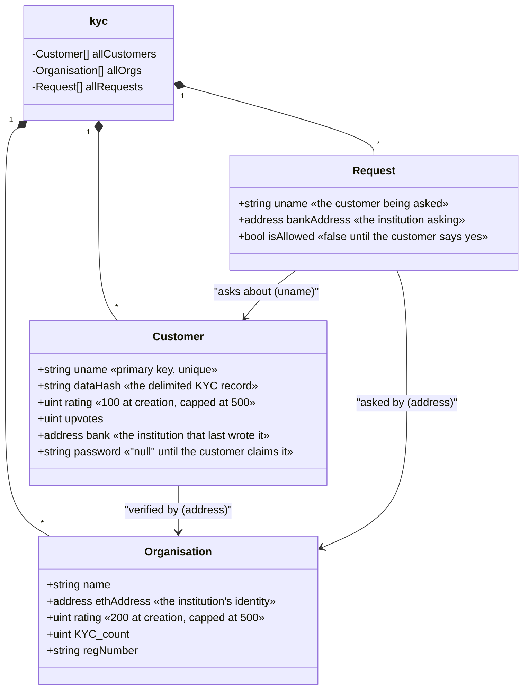

Two things worth noticing. **Customers are keyed by a username string, not by an Ethereum address** —
a customer does not need a wallet to have a KYC record, which is deliberate, since the bank creates
the record before the customer ever logs in. And **`Request` is a join row**: one per
(customer, bank) pair, carrying the consent flag.

## 1.5 Runtime and deployment

Everything runs on one machine. There is no hosted deployment, and for a project that writes
personal data to a ledger, that is the right default.

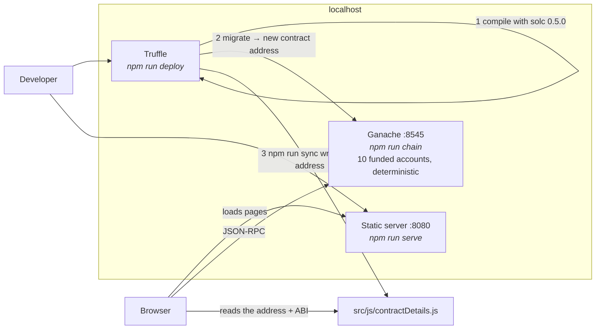

Step 3 is the one that used to bite. Every `truffle migrate` deploys a **new** contract at a **new**
address, and the front end reads a hard-coded address. Before `scripts/sync-contract.js` existed,
that address had to be pasted in by hand, and forgetting meant the pages loaded perfectly but every
call came back empty. `npm run deploy` now does the migrate and the sync together.

## 1.6 Design decisions

| # | Decision | Alternatives | Why it was made — and how it holds up |
|---|---|---|---|
| 1 | **Store consent on-chain** rather than in an institution's access-control list | A permissioned database at each bank | The strongest idea in the project. A customer can prove who was allowed to see their file, and no bank can quietly grant itself access. This is what makes it a DApp rather than a website with a blockchain bolted on. |
| 2 | **Key customers by username**, not by wallet address | One record per Ethereum address | Lets a bank create a record for someone who has no wallet yet, which is how onboarding actually works. The cost is that usernames are a global namespace with no ownership proof until the customer claims one. |
| 3 | **Dynamic arrays**, not mappings | `mapping(string => Customer)` | Arrays can be enumerated, which the request queue needs. But every lookup is a linear scan with a string comparison, so gas grows with the size of the network — see [2.8](#28-storage-layout-and-cost). A mapping plus an index array would give both. |
| 4 | **Return codes instead of `revert`** | `require` with a reason string | Lets the front end call a function first, read the code, and only then send a transaction, which avoids paying for a doomed write. It also means a failed call looks identical to a successful one on chain, and nothing is logged. Events would fix that. |
| 5 | **Ganache and a local chain**, not a public testnet | Sepolia via Infura | Free, instant, and resettable. It also keeps a build that writes plaintext personal data off a public network, which is the responsible choice for this code. |
| 6 | **Plain HTML, jQuery and web3 0.20** | React plus ethers.js | Nothing to build, nothing to install, and the whole client is readable in an afternoon. web3 0.20's synchronous calls are what make the page scripts so short — and are also deprecated, because they block the UI thread. |
| 7 | **A rating for banks as well as customers** | Rate customers only | A bank that adds records that later turn out fraudulent loses rating, so reputation cuts both ways. Nice idea, undercut by the fact that any registered bank can call the rating functions on anyone. |

## 1.7 Trust model

Who is allowed to do what, as the contract actually enforces it:

| Action | Enforced by | Holds up? |
|---|---|---|
| Register the first bank | Nothing — the network starts empty and the first caller wins | Intended: someone has to bootstrap |
| Register a further bank | `isPartOfOrg(msg.sender)` — an existing member must send the transaction | Yes |
| Create, modify or delete a customer record | `isPartOfOrg(msg.sender)` | Yes for *whether you are a bank*; no for *which* bank — any member can overwrite any record |
| Read a customer record | `isPartOfOrg(msg.sender)` | **Only in the UI.** `viewCustomer` gates on membership, not on consent; the consent check `ifAllowed` is called by the page, not by the contract |
| Grant or revoke consent | Nothing | **No check at all** — `allowBank` accepts a username from any caller |
| Change a rating | Nothing on `updateRatingCustomer` | Any address can move any customer's rating |

The last three rows are the honest answer to "is this production-ready", and they are written up with
fixes in [`SECURITY.md`](../SECURITY.md). They are also exactly the kind of finding that makes this
project worth reading: the *architecture* is sound, the *enforcement* is in the wrong layer.

---

# Part 2 — Low-level design

## 2.1 Page map and navigation

Seven static pages, no router and no framework. State moves between pages through `localStorage`.

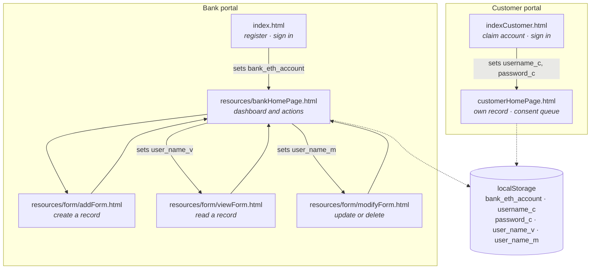

`localStorage` is doing the job a session would do on a server — and it is doing it in the clear, in
a place the user can edit. Setting `bank_eth_account` by hand in the console is enough to reach the
bank dashboard, because the dashboard never re-checks. The contract still refuses writes from an
address that is not a registered bank, so this is a UI bypass rather than a data breach — but it
should be a signed challenge, not a string in web storage.

## 2.2 Sequence — a bank joins the network

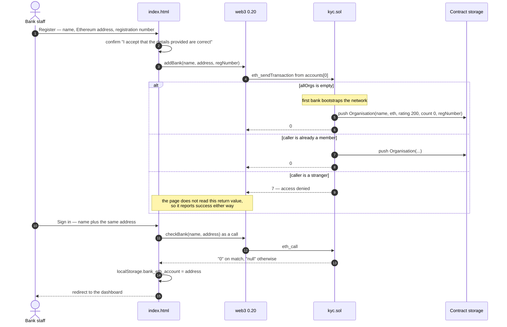

Two things this diagram makes plain. The field labelled **"password" is an Ethereum address** — the
contract's parameter is `address password`, and sign-in succeeds for anyone who can type the bank's
public address, which is on the ledger by definition. And the page ignores `addBank`'s return code,
so a rejected registration still shows "successfully added to the network".

## 2.3 Sequence — creating a KYC record

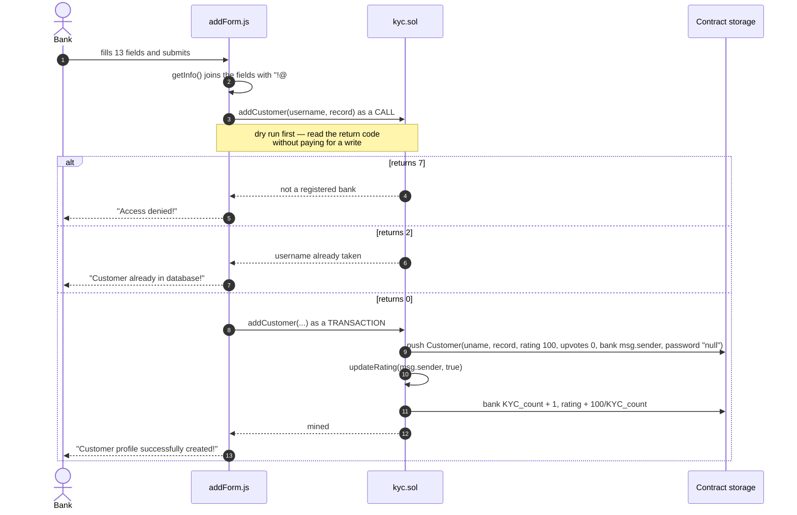

The call-then-transact pattern in steps 3 and 8 is the workaround for return codes: the call is free
and tells you what would happen, the transaction then does it. It costs a round trip and it is racy —
nothing stops the state changing between the two — but on a single-user local chain it works, and it
is a reasonable answer to a contract that signals failure by returning a number.

## 2.4 Sequence — consent, the core of the design

This is the flow the whole project exists for.

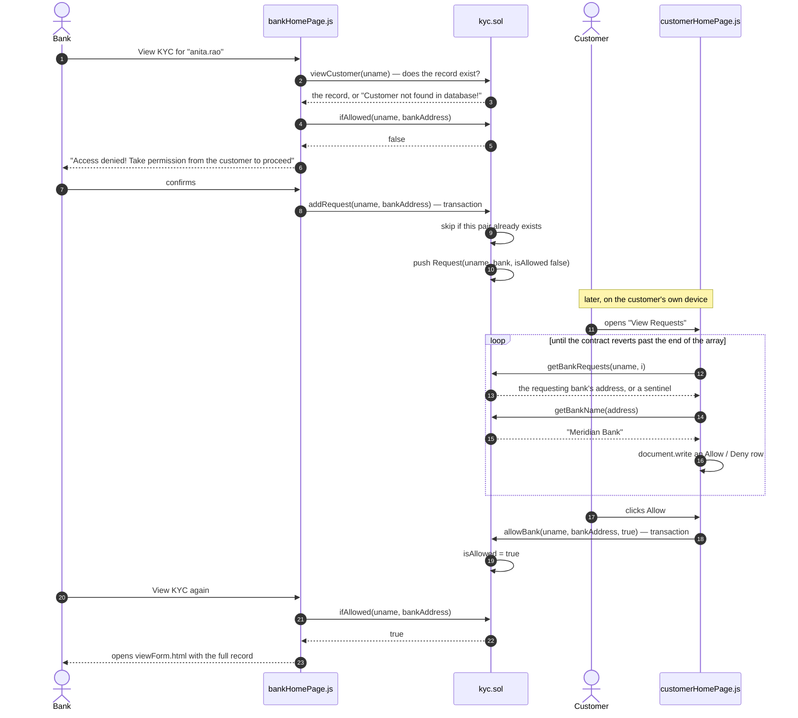

**The loop in steps 12 to 17 has no termination condition.** `getBankRequests` indexes
`allRequests[ind]` directly, so once `i` runs past the end the EVM raises an invalid-opcode
exception; web3's synchronous call turns that into a JavaScript throw, which unwinds the loop. The
list renders correctly and the browser console shows an uncaught exception every time. It works by
accident, and a `getRequestCount()` view would make it work on purpose.

**And the consent check lives in the wrong place.** `ifAllowed` is consulted by `bankHomePage.js`
before it navigates. `viewCustomer` itself only checks membership. A bank that calls the contract
directly — with `curl`, or Remix, or thirty lines of ethers — reads any record it likes without ever
asking. Moving the `ifAllowed` check inside `viewCustomer` is a four-line change and is the single
most important fix in [`SECURITY.md`](../SECURITY.md).

## 2.5 State machine — an access request

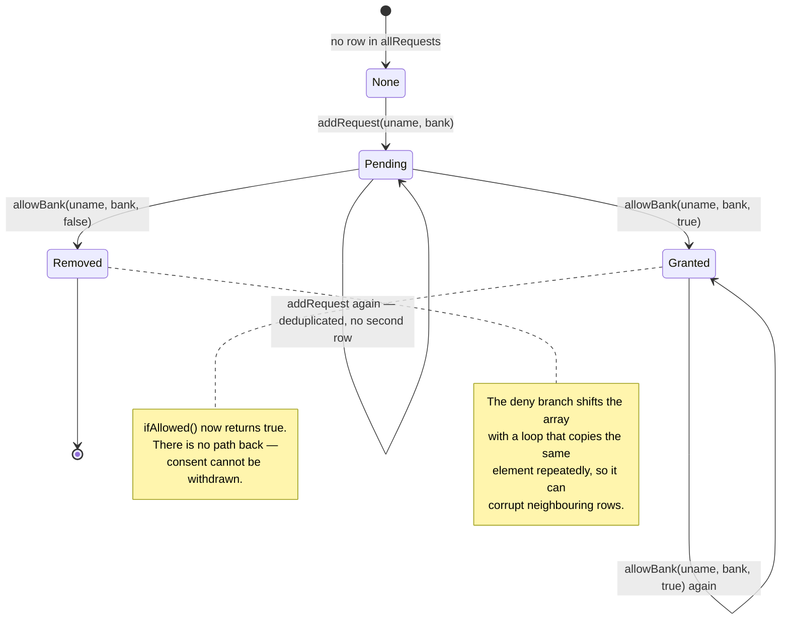

Two gaps fall straight out of drawing it: **consent is permanent once given** — there is no
`revokeBank` — and the deny path's array-shift loop is wrong (`allRequests[i] = allRequests[i+1]`
inside a loop over `j`, which never advances `i`). Both are listed with fixes in `SECURITY.md`.

## 2.6 How a record is encoded

The contract stores one `string dataHash` per customer. The field name is aspirational — it is not a
hash, it is the record itself, concatenated by the browser.

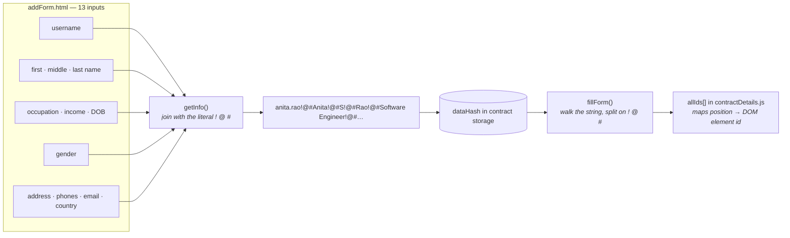

The consequences are worth stating plainly, because they are a good illustration of why encoding
choices matter:

- **A field containing `!@#` corrupts every field after it.** There is no escaping.
- **Position is the schema.** `allIds` in `contractDetails.js` is the only thing that says index 6 is
  the date of birth. Insert a field in the form and every existing record is misread.
- **Gender is special-cased.** `fillForm()` hard-codes "when `j` reaches 7, write to `gender_m` and
  skip ahead by two", because the form uses two radio ids for one stored value.
- **Everything is public.** `dataHash` is a plain string in contract storage. Anyone with the
  contract address can read every customer's name, date of birth, address, phone numbers, email and
  income band without any permission at all. The roadmap's answer — encrypt, store on IPFS, keep only
  the content hash on chain — is the right one, and the RSA library is already sitting unused in
  `src/RSA_JS/` waiting for it.

## 2.7 The rating algorithm

Both ratings use the same shape: a running score with diminishing returns, held to two decimal
places by storing it multiplied by 100.

```
bank      starts at 200 (2.00 stars)
          +100 / KYC_count on each record added
          −100 / (KYC_count + 1) when one of its records is deleted
          capped at 500

customer  starts at 100 (1.00 stars)
          upvote   → upvotes + 1, rating += 100 / upvotes
          downvote → upvotes − 1, rating −= 100 / (upvotes + 1)
          capped at 500
```

The first record a bank verifies is worth a full star, the second half a star, the tenth a tenth —
so a bank cannot inflate its score cheaply. Three caveats, all of them real:

- `if (rating < 0)` can never be true: `rating` is a `uint`, and in Solidity 0.5 subtracting past
  zero wraps to a colossal number instead of going negative. The guard reads as defensive and does
  nothing.
- `updateRatingCustomer(uname, false)` decrements `upvotes` first. At zero upvotes that also wraps.
- Neither rating function checks the caller, so any address can rate anyone.

## 2.8 Storage layout and cost

Every lookup is a linear scan, and every comparison compares strings byte by byte in the EVM:

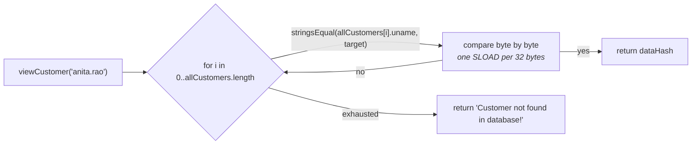

| Operation | Complexity | Consequence |
|---|---|---|
| `viewCustomer`, `modifyCustomer`, `removeCustomer` | O(n) customers × O(len) per comparison | Cost grows with the size of the whole network, not with your record |
| `isPartOfOrg` — runs on nearly every write | O(m) banks | Paid on top of the operation itself |
| `ifAllowed` | O(r) requests, and requests are never pruned | Grows for ever |
| `addCustomer` | O(n) to check for duplicates, then a push | The duplicate check dominates |

On a local chain with three customers this is invisible. On a real network it is the difference
between a working system and one nobody can afford to call. `mapping(string => uint) indexOfCustomer`
alongside the array would make every one of these O(1) while keeping enumeration — it is the first
change a rewrite should make.

Two further notes on the storage functions. `removeCustomer` and `removeBank` both shift with
`allCustomers[i-1] = allCustomers[i]`, which underflows when `i` is 0 and copies in the wrong
direction; deleting a record is not safe. And every function — getters included — is declared
`payable` and non-`view`, which is why the front end has to say `.call()` explicitly everywhere.
Marking the getters `view` would make them free by default and let other contracts read them.

## 2.9 Return codes

The contract signals outcomes by returning a `uint`. Collected in one place, since it is scattered
across the source:

| Code | Meaning | Returned by |
|---|---|---|
| `0` | Success | `addBank`, `removeBank`, `addCustomer`, `removeCustomer`, `modifyCustomer`, `updateRating`, `updateRatingCustomer` |
| `1` | Not found — or, in `addCustomer`, an array-length overflow that cannot occur | `removeBank`, `removeCustomer`, `modifyCustomer`, `updateRating`, `updateRatingCustomer` |
| `2` | Username already in use | `addCustomer` |
| `7` | Caller is not a registered bank | `addBank`, `removeBank`, `addCustomer`, `removeCustomer`, `modifyCustomer` |

String-returning functions use sentinels instead: `"Access denied!"`, `"Customer not found in
database!"`, `"null"`, `"0"` for a successful bank sign-in, and the address
`0x14E041521a40e32ED88b22C0F32469F5406d757A` as a "no such address" marker. Sentinel values that
look like real values are a recurring source of bugs here — the front end compares against these
strings literally, so changing a message breaks the logic.

---

# Part 3 — Cross-cutting

## 3.1 The local environment

Four commands, in this order:

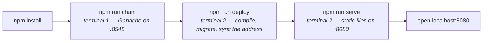

`npm run chain` starts Ganache with `--wallet.deterministic`, so the ten accounts are the same on
every machine and on every restart. That matters more than it sounds: the "password" a bank signs in
with is an Ethereum address, so a stable set of accounts is what makes the walkthrough in the README
reproducible.

Restarting Ganache wipes the chain. Re-run `npm run deploy` afterwards — the contract address
changes, and `npm run sync` is what writes the new one into `src/js/contractDetails.js`.

## 3.2 What a rewrite would change

Keeping the same idea and the same three entities, built today:

| Area | This build | A 2026 build |
|---|---|---|
| Personal data | The full record as a plain string on chain | Encrypt client-side, pin the ciphertext to IPFS, store only the CID on chain |
| Consent enforcement | Checked by the page before navigating | Checked inside `viewCustomer`, so the contract is the gate |
| Identity | Username string plus a plaintext password in storage | The customer's own address; sign a nonce to authenticate, no passwords anywhere |
| Lookups | Linear scans over arrays | `mapping` for lookup, array for enumeration |
| Failure signalling | Magic return codes | `require` with reason strings, plus events for every state change |
| Access control | `isPartOfOrg` repeated inline | OpenZeppelin `AccessControl` with explicit roles |
| Record schema | `!@#`-delimited string | A struct, or JSON pinned off-chain |
| Toolchain | Truffle 5 and web3 0.20 | Hardhat or Foundry, ethers v6, MetaMask via EIP-1193 |
| Tests | None | Property tests around consent and ratings, plus a fuzz run on the rating maths |
| Compiler | 0.5.0, pinned because the code needs it | 0.8.x, where the arithmetic overflows in [2.7](#27-the-rating-algorithm) revert instead of wrapping |

## 3.3 Roadmap

In the order that would add the most value:

1. **Move the consent check into the contract.** One function, four lines, and the security model
   becomes real rather than cosmetic.
2. **Take personal data off the chain.** Encrypt in the browser with the RSA code already sitting in
   `src/RSA_JS/`, pin to IPFS, keep the CID on chain. This was the original plan — the notes the
   project started from say exactly this — and it is the difference between a demo and something
   defensible.
3. **Replace the password with a wallet signature.** MetaMask was always meant to be the customer's
   key; using it removes the plaintext password entirely.
4. **Add `revokeBank`.** Consent that cannot be withdrawn is not really consent.
5. **Emit events** for registration, record changes and consent, so there is an auditable history
   rather than just current state.
6. **Then the lending platform this was built for:** a borrower pool where requests carry amount,
   interest and supporting documents, lenders browse and offer, and the agreement is recorded on
   chain — with the credit score derived from repayment history and this KYC layer keeping one
   person to one identity.
